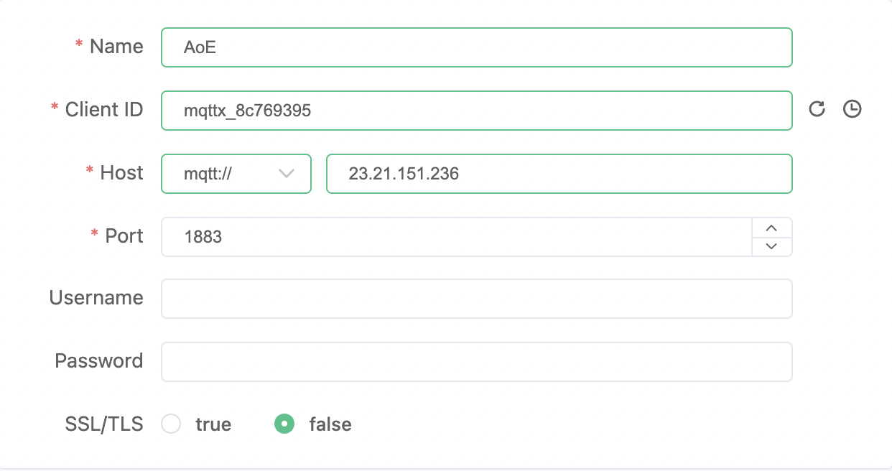
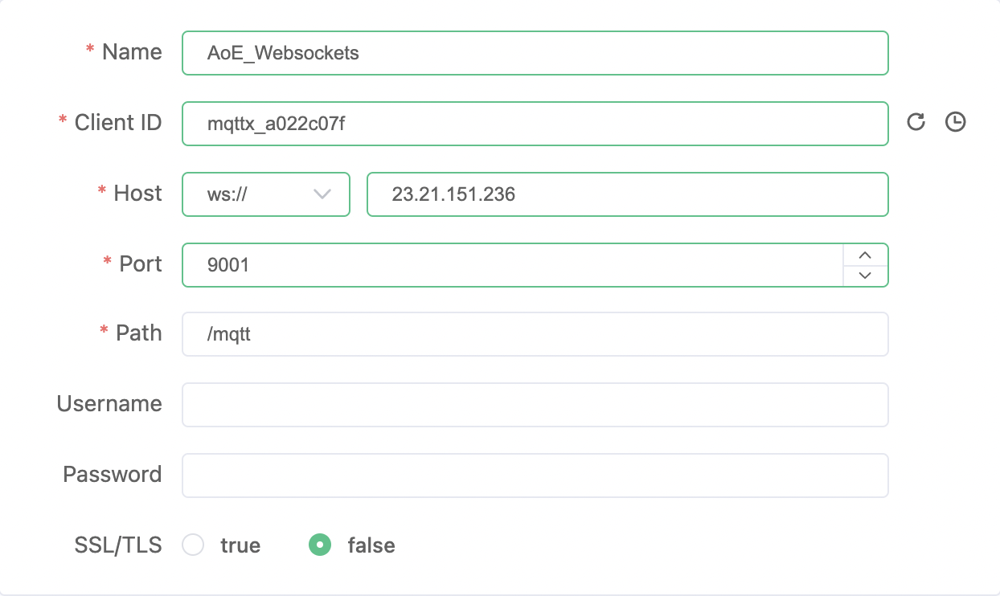
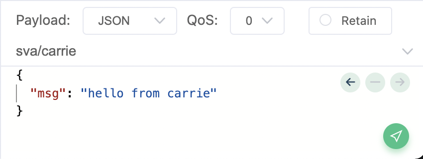

# IoT

# SVA IxD | Week 9

# MQTT

Let's install [MQTTx](https://mqttx.app/) and set up some client connections for sending and receiving messages

## Testing MQTT

Now that you have the MQTTx installed let's create some clients and test publishing and subscribing to messages.

### Client 1 (MQTT via TCP)

### Client 2 (MQTT via Websockets)

## Combining MQTT with P5js

We will add MQTT to [a p5.js app](./p5).

## Publishing messages to your P5js application

The example application is subscribed to the topic `sva/#`. `#` is a wildcard indicator meean you can publish topics like `sva/carrie`, `sva/bruno` or `sva/coding` etc and the application will receive them. Check your console logs in the developer tools to check that it's working.

The MQTT client comes from this [include](https://github.com/areaofeffect/hello-world/blob/master/week9/p5/index.html#L13). Documentation about this can be found [here](https://github.com/eclipse/paho.mqtt.javascript).
