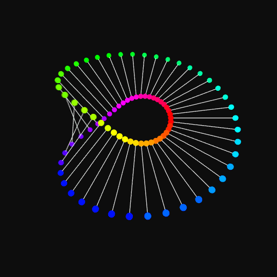

# Loops

# SVA IxD Week 4

[Week 4 slides](http://hello-world-week4.s3-website-us-east-1.amazonaws.com/)

## Review and Discussion of Week 3

_Operators, Conditionals, Functions_

- Assignment, Comparison, and Logical Operators

- Compound Operators

- If, Else, Elif Conditional statemtents

- Function declaration, definition, parameters and arguments

### Deep Deep Forest

_Week 3 Assignment: Lets playtest our games!_

### Review of Functions

    def sayMessage(myMessage):
    	print(myMessage)

    sayMessage(myMessage)
    sayMessage("goodbye")

[Week3 Examples](https://github.com/areaofeffect/hello-world/blob/week4/week3/examples/functions.py)

# LOOPS

_a loop is a sequence of instruction s that is continually repeated until a certain condition is reached._

You can use loops to run sections of code over and over again.
There are many types of loops but we will focus on `for` and `while` for learning.

Some inspiration from Bees and Bombs: [https://beesandbombs.tumblr.com/](https://beesandbombs.tumblr.com/)

Python example 1

a simple counting example

try it out: [repl link](https://replit.com/@codelit/python-for)

    for x in range(1,10):
    	print(x)

Python example 2

example: looping through an array

try it out: [repl link](https://replit.com/@codelit/python-for)

    # declare an array
    fruits = [ "mango", "banana", "apple" ]

    # loop through items in array
    for fruit in fruits:
      print fruit

JavaScript Example

try it out: [repl link](https://replit.com/@codelit/javascript-for)

[https://www.learn-js.org/en/Loops](https://www.learn-js.org/en/Loops)

    // declare an array
    var fruits = [ "mango", "strawberry", "kiwi" ];

    // loop through items in arary
    // note: .length is a property of array datatype that results to 3
    for (x = 0; x < fruits.length; x++) {
      console.log(fruits[x]); // print each string
    }

JavaScript p5 examples

The code inside the `draw(`) function runs continuously from top to bottom until the program is stopped.

- [https://p5js.org/examples/structure-loop.html](https://p5js.org/examples/structure-loop.html)
- [http://learningprocessing.com/examples/chp06/example-06-06-forloop](http://learningprocessing.com/examples/chp06/example-06-06-forloop)

---

C Example

there's a repl: [for that too!](https://replit.com/@codelit/c-for)

    #include <stdio.h>

    int main() {
      // note: remember to type your variable
      for (int a = 1; a <= 20; a++) {
          printf("value of a: %d\n", a);
      }
    }

## while loops

Python example

[repl link](https://replit.com/@codelit/python-while)

    while x < 10:      # do this ten times
      increaseCount() # call a function we defined above

JavaScript example

[repl link](https://replit.com/@codelit/javascript-while)

[w3schools: while example](https://www.w3schools.com/js/tryit.asp?filename=tryjs_while)

    while (i < 10) {
        text += "The number is " + i;
        i++;
    }

C Example

try in a repl: [repl link](https://replit.com/@codelit/c-while)

[arduino example](https://www.arduino.cc/en/Tutorial/WhileStatementConditional)

    #include <stdio.h>

    int main () {

       /* local variable definition */
       int a = 0;

       /* while loop execution */
       while( a <= 10 ) {
          printf("value of a: %d\n", a);
          a++;
       }

       return 0;
    }

## "break" and "continue" statements

`break` is used to exit a `for` or a `while` loop

Python example

This will break and exit the loop once the count is greator than five.

try it out: [repl link](https://replit.com/@codelit/python-break)

    for x in range(1,10):	# a for loop that counts from 1 to 10
    	if (x > 5): 		# a conditional, are we less than 5
    	  break 			# exit the loop once our count is higher than 5
    	else:
    		print(x)

# draw()

A draw loop is a type of loop that occurs _every frame_ of your application. It is generally used for programing animations, interactions or visuals. Think of it working like a movie or gif with sequential frames.

In Arduino programming this is simply called loop().

> After creating a setup() function, which initializes and sets the initial values, the loop() function does precisely what its name suggests, and loops consecutively, allowing your program to change and respond. Use it to actively control the Arduino board.

- [Arduino Loop](https://www.arduino.cc/en/Reference/Loop)
- [p5 Loop](https://p5js.org/examples/structure-loop.html)

# recursion

The most common application of recursion is in mathematics and computer science, where a function being defined is applied within its own definition. While this apparently defines an infinite number of instances (function values), it is often done in such a way that no loop or infinite chain of references can occur.

- Factorials
- Fractals
- Inception

# variables and scope

- Local variables
- Global variables

# A review of syntax

Helpful hints in

- Convert tabs to spaces
- Remember to choose your language for syntax highlighting
- [Common Shortcuts](http://docs.sublimetext.info/en/latest/reference/keyboard_shortcuts_osx.html)
- [Plugins and package control](https://packagecontrol.io/)

# Assignment

Create a generative artwork or study using loops and repetition. You can use JavaScript (p5) or python.

Some inspiration:

- [Vera Molnár](https://ropac.net/artists/231-vera-molnar/)
- [More Vera Molnár](https://www.youtube.com/watch?v=8tNESHtfkr0)
- [http://printingcode.runemadsen.com/lecture-repetition/](http://printingcode.runemadsen.com/lecture-repetition/)
- [Form + Code](http://formandcode.com/code-examples/repeat-embedded)
- [Phyllotaxis](https://www.youtube.com/watch?v=KWoJgHFYWxY)
- [Turtle](https://trinket.io/python/43bc79b582)

## resources

- [learnpython.org loops tutorial](https://www.learnpython.org/en/Loops)
- [Tutorials Point python overview](https://www.tutorialspoint.com/python/)
- [Coding Train with Daniel Shiffman](https://www.youtube.com/watch?v=h4ApLHe8tbk)
- [Invent With Python - Tic Tac Toe](https://inventwithpython.com/chapter10.html)
- [Tic Tac Toe AI with Javascript](https://mostafa-samir.github.io/Tic-Tac-Toe-AI/)
- [JavaScript For Loops](https://www.w3schools.com/js/js_loop_for.asp)

# Turtle Time!

- [Python Turtle](https://www.youtube.com/watch?v=Grc1-j4EvTk)
- [Great tutorial on drawing with Python and Turtle](https://github.com/asweigart/simple-turtle-tutorial-for-python/blob/main/simple_turtle_tutorial.md)
- [Ideo: Painting with Code](https://labs.ideo.com/2014/06/04/painting-with-code/)
