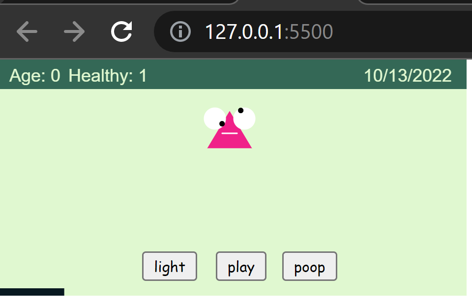

# CLASS NOTES

- Week 5: Loops, Part 2
  - Complex repitition
  - Nest loops
  - Recursion
  - Syntax
- Week 6: Organizing everything we learned into a more complex program
  - Scope
    - Lexical Scope and Dynamic Scope
    - Levels of Scope
      - Expression
      - Block
      - Function
      - File
      - Module
      - Global
  - Modules and Libraries
    - Writing your own
    - Using NPM
    - Using Arduino Libraries
  - Classes: Organizing code into reusable blocks ( OOP )
  - Introduction to Github
  - Introduction to Node and Interactivity

<br>

# Useful functions and code help

Remember to always check the p5 reference first!

## https://p5js.org/reference/

<br>

Creating buttons:

- https://p5js.org/reference/#/p5/createButton

Calculating angles:

- https://p5js.org/examples/math-arctangent.html

Loop templates and advanced animations:

- https://github.com/golanlevin/LoopTemplates

Some more examples on using transformations via Gene Kogan:

- https://genekogan.com/code/p5js-transformations/

<br>

# Working with video and gifs

Setting the current frame of a video:
- https://editor.p5js.org/brunokruse/sketches/z6CtepvN7

Additional things you can do with video playback:
- https://p5js.org/reference/#/p5.MediaElement

Setting the current frame of a gifs:
- https://p5js.org/reference/#/p5.Image/setFrame

Renaming files in a folder via python:
- https://stackoverflow.com/questions/18805348/how-rename-the-images-in-folder/47105286#47105286

<br>

# Clock Assignment:

Examples:

- https://p5js.org/examples/input-clock.html
- https://codingtrain.github.io/12oclocks/
- http://golancourses.net/2018_60212f/category/03/03-clock/

Reading:

- http://www.naimark.net/writing/firstword.html

<br>

# Clock monsters demo

```
// a prototype clock monster game based on time
// more features coming soon...
// https://www.bandai.com/wp-content/uploads/TamaIS_Gen2_pg1.pdf
```

This app contains two files. `sketch.js` and `monster.js`

Rember to update your `index.html` to include both files:

```
  <body>
    <script src="sketch.js"></script>
    <script src="monster.js"></script>
  </body>
```

<br>



<br>

Features:

- each minute the monster grows 1 year in monster time
- monster eyes rotate to the current time (hour and minute)
- monster is proceduraly generated each refresh
- click to add 1 food (they help the monster)
- random chance of fleas (they hurt the monster)
- turn light on and off (might anger monster)
- play with monster ... coming soon
- clean monster ... coming soon

<br>

# CUSTOM PIXEL:

The custom pixel with video input we did in class is [here](./p5-custom-pixel)

Another version that uses images is [here](./p5-custom-pixel-2)