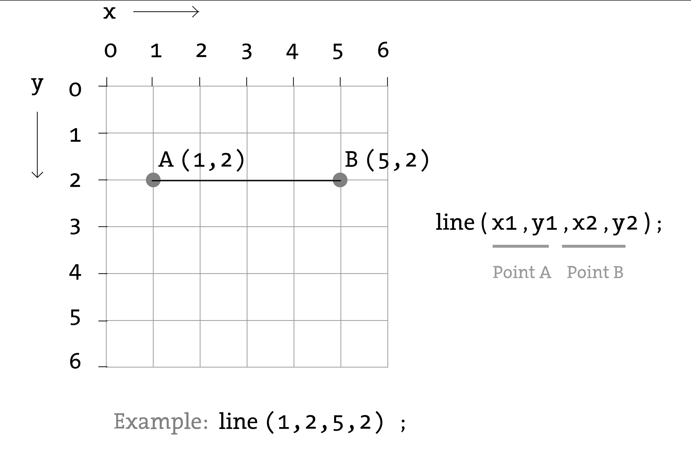
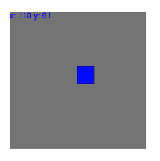
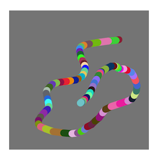
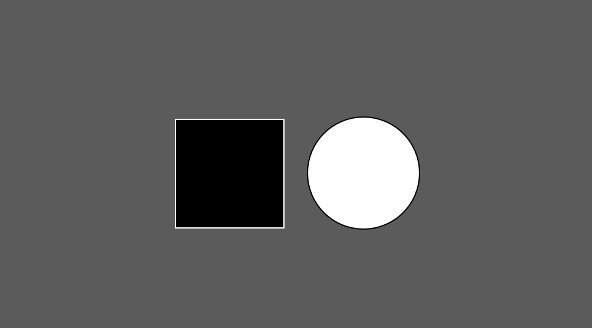
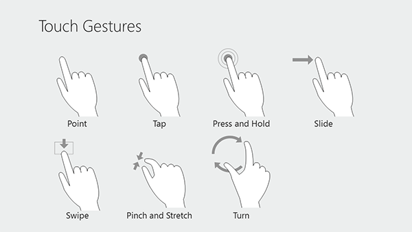
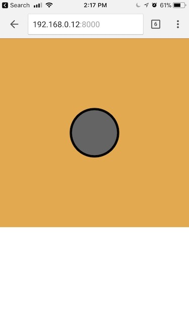

# PROGRAMMING INTERACTIVITY
# SVA IxD WEEK 7  

[Week 7 slides](http://hello-world-week7.s3-website-us-east-1.amazonaws.com/)

<br/>

##### Introduction
> Introduction is adapted from the Interactivity chapter of Processing by John Maeda and Casey Raes and various p5 sources referenced below.

<br/>

The screen forms a bridge between our bodies and the realm of circuits and electricity inside computers. We control elements on screen through a variety of devices such as touch pads, trackballs, and joysticks, but the keyboard and mouse remain the most common input devices for desktop computers. The computer mouse dates back to the late 1960s, when Douglas Engelbart presented the device as an element of the oN-Line System (NLS), one of the first computer systems with a video display. The mouse concept was further developed at the Xerox Palo Alto Research Center (PARC), but its introduction with the Apple Macintosh in 1984 was the catalyst for its current ubiquity. The design of the mouse has gone through many revisions in the last forty years, but its function has remained the same. In Engelbart's original patent application in 1970 he referred to the mouse as an "X-Y position indicator," and this still accurately, but dryly, defines its contemporary use.

The physical mouse object is used to control the position of the cursor on screen and to select interface elements. The cursor position is read by computer programs as two numbers, the x-coordinate and the y-coordinate. These numbers can be used to control attributes of elements on screen. If these coordinates are collected and analyzed, they can be used to extract higher-level information such as the speed and direction of the mouse. This data can in turn be used for gesture and pattern recognition.

Keyboards are typically used to input characters for composing documents, email, and instant messages, but the keyboard has potential for use beyond its original intent. The migration of the keyboard from typewriter to computer expanded its function to enable launching software, moving through the menus of software applications, and navigating 3D environments in games. When writing your own software, you have the freedom to use the keyboard data any way you wish. For example, basic information such as the speed and rhythm of the fingers can be determined by the rate at which keys are pressed. This information could control the speed of an event or the quality of motion. It's also possible to ignore the characters printed on the keyboard itself and use the location of each key relative to the keyboard grid as a numeric position.

The modern computer keyboard is a direct descendant of the typewriter. The position of the keys on an English-language keyboard is inherited from early typewriters. This layout is called QWERTY because of the order of the top row of letter keys. It was developed for typewriters to put physical distance between frequently typed letter pairs, helping reduce the likelihood of the typebars colliding and jamming as they hit the ribbon. This more than one-hundred-year-old mechanical legacy still affects how we write software today.

<br/>

# Week 6

Examples:
[https://github.com/areaofeffect/hello-world/tree/master/week7/examples](https://github.com/areaofeffect/hello-world/tree/master/week7/examples)

<br/>

# Coordinate system
> The coordinate system for pixels in a computer window, however, is reversed along the y-axis. (0,0) can be found at the top left with the positive direction to the right horizontally and down vertically.

[https://processing.org/tutorials/drawing/]([https://processing.org/tutorials/drawing/])

<br/>



<br/>

# Mouse Position
The p5 variables mouseX and mouseY (note the capital X and Y) store the x-coordinate and y-coordinate of the cursor relative to the origin in the upper-left corner of the display window. To see the actual values produced while moving the mouse, run this program to print the values to the console:

```
function draw() {
  println(mouseX + " : " + mouseY);
}
```

- mouseX
- mouseY

*The system variable mouseX always contains the current horizontal position of the mouse, relative to (0, 0) of the canvas. If touch is used instead of mouse input, mouseX will hold the x value of the most recent touch point.*

```
// the following will draw a rectangle at your mouse position
function draw() {
  background(244, 248, 252);
  rect(mouseX, mouseY, 100, 100);
}
```



When a program starts, the mouseX and mouseY values are 0. If the cursor moves into the display window, the values are set to the current position of the cursor. If the cursor is at the left, the mouseX value is 0 and the value increases as the cursor moves to the right. If the cursor is at the top, the mouseY value is 0 and the value increases as the cursor moves down. If mouseX and mouseY are used in programs without a draw() or if noLoop() is run in setup(), the values will always be 0.

The mouse position is most commonly used to control the location of visual elements on screen. More interesting relations are created when the visual elements relate differently to the mouse values, rather than simply mimicking the current position. Adding and subtracting values from the mouse position creates relationships that remain constant, while multiplying and dividing these values creates changing visual relationships between the mouse position and the elements on the screen. In the first of the following examples, the circle is directly mapped to the cursor, in the second, numbers are added and subtracted from the cursor position to create offsets, and in the third, multiplication and division are used to scale the offsets.

# Mouse Events

Computer mice and other related input devices typically have between one and three buttons; Processing can detect when these buttons are pressed with the mousePressed and mouseButton variables. Used with the button status, the cursor position enables the mouse to perform different actions. For example, a button press when the mouse is over an icon can select it, so the icon can be moved to a different location on screen. The mousePressed variable is true if any mouse button is pressed and false if no mouse button is pressed. The variable mouseButton is `LEFT`, `CENTER`, or `RIGHT` depending on the mouse button most recently pressed. The `mousePressed` variable reverts to false as soon as the button is released, but the `mouseButton` variable retains its value until a different button is pressed. These variables can be used independently or in combination to control the software. Run these programs to see how the software responds to your fingers.

<i>The mouse event functions are `mousePressed()`, `mouseReleased()`, `mouseMoved()`, and `mouseDragged()`:</i>

##### mouseReleased()
Code inside this block is run one time when a mouse button is pressed mouseReleased()

##### mouseMoved()
Code inside this block is run one time when a mouse button is released mouseMoved()

##### mouseDragged()
Code inside this block is run one time when the mouse is moved mouseDragged()

##### mousePressed()
Code inside this block is run one time when the mouse is moved while a mouse button is pressed


# A drawing app
Combine what we learned above to create a drawing app. Use your mouse do draw.



```
function mouseDragged() {
  // drag to draw a line from previous mouse position
  // to current mouse position
  stroke(random(255),random(255),random(255));
  line(mouseX, mouseY, pmouseX, pmouseY);
}
```

- mouseX
- mouseY
- pmouseX
- pmouseY


# Creating interfaces

Since we can now keep track of our mouse position and click events, we can begin to build apps that begin to explore hovering, clicking, dragging and even tapping / pinching elements on the screen.

The first step is to calculate if our `mouseX`, `mouseY` positions are within the bounding box of our object. Let's start with simple rectangle and ellipse shapes.



https://processing.org/examples/button.html

<br/>

##### Rectangular buttons
The most common type of bounding box is a rectangle. Our mouse is inside a rectangle when `mouseX` and `mouseY` are inside it's bounds.

The bounds of a rectangle can be thought of like its area.

- x position of the rectangle plus the rectangles width
- y position of the rectangle plus the rectangles height

```
// check if mouse is inside the rectangle
// mouseX >= x && mouseX <= x+width && mouseY >= y && mouseY <= y+height
if (mouseX >= 150 && mouseX <= 150+100 && mouseY >= 150 && mouseY <= 150+100){
  isOverRectangle = true;
} else {
  isOverRectangle = false;
}
```

<br/>

##### Circular buttons
We can calculate the distance from our mouse position to the center of a point. If this value is less than the radius of your object - our mouse cursor must be inside. See the example below.


```
// get distance between mouse and circle
var distance = dist(mouseX, mouseY, 200, 200);

// if the distance is less than the circle's radius
if(distance < 50) {
  isOverCircle = true;
} else {
  isOverCircle = false;
}
```

[http://coursescript.com/notes/interactivecomputing/interactivity/](http://coursescript.com/notes/interactivecomputing/interactivity/)
> Tutorial via John Kuiphoff / Interactive Computing

# Keyboard Events
Processing registers the most recently pressed key and whether a key is currently pressed. The boolean variable keyPressed is true if a key is pressed and is false if not. Include this variable in the test of an if structure to allow lines of code to run only if a key is pressed. The keyPressed variable remains true while the key is held down and becomes false only when the key is released.


##### keyPressed()
```
function keyPressed() {
    if(keyCode == UP_ARROW) {
        colorValue = 0;
    } else if (keyCode == DOWN_ARROW) {
        colorValue = 255;
    }
    return 0;
}
```

##### keyReleased()
```
function keyPressed() {
    if(keyCode == UP_ARROW) {
        colorValue = 0;
    } else if (keyCode == DOWN_ARROW) {
        colorValue = 255;
    }
    return 0;
}
```

##### keyCode
In addition to reading key values for numbers, letters, and symbols. If you're making cross-platform projects, note that the Enter key is commonly used on PCs and UNIX and the Return key is used on Macintosh. Check for both Enter and Return to make sure your program will work for all platforms.

*The variable keyCode is used to detect special keys such as BACKSPACE, DELETE, ENTER, RETURN, TAB, ESCAPE, SHIFT, CONTROL, OPTION, ALT, UP_ARROW, DOWN_ARROW, LEFT_ARROW, RIGHT_ARROW You can also check for custom keys by looking up the keyCode of any key on a site like this: [http://keycode.info/](http://keycode.info/)*

```
if (keyCode == UP_ARROW) {
    y += 1;
}
```

##### key
The key variable stores a single alphanumeric character. Specifically, it holds the most recently pressed key. The key can be displayed on screen with the text() function (p. 150).

`text(key, 33,65); // Display last key pressed.`

The key variable may be used to determine whether a specific key is pressed. The following example uses the expression key=='A' to test if the A key is pressed. The single quotes signify A as the data type char (p. 144). The expression key == "A" will cause an error because the double quotes signify the A as a String, and it's not possible to compare a String with a char. The logical AND symbol, the && operator, is used to connect the expression with the keyPressed variable to ascertain that the key pressed is the uppercase A.

##### keyIsPressed
```
function draw() {
  background(0);
  // If the 'A' key is pressed fill white
  if ((keyIsPressed == true) && (key == 'A')) {
    fill(255);
  } else {
  	 // otherwise, fill black
    fill(0);
  }
}
```

The previous example works with an uppercase A, but not if the lowercase letter is pressed. To check for both uppercase and lowercase letters, extend the relational expression with a logical OR, the || relational operator. Line 4 in the previous program would be changed to:

```
if ((keyIsPressed == true) && ((key == 'a') || (key == 'A'))) {
	// your code here
}
```

Because each character has a numeric value as defined by the ASCII table (p. 605), the value of the key variable can be used like any other number to control visual attributes such as the position and color of shape elements. For instance, the ASCII table defines the uppercase A as the number 65, and the digit 1 is defined as 49.

##### Simple Drawing app

```
function setup() {
 	createCanvas(displayWidth, displayHeight);
	strokeWeight(10)
	stroke(0);
}

function mouseMoved() {
	// draw a line from previouse mouse position
	// to current mouse position
	line(mouseX, mouseY, pmouseX, pmouseY);
	return false;
}
```


# Touch Events




##### touchStarted()
[https://p5js.org/reference/#/p5/touchStarted](https://p5js.org/reference/#/p5/touchStarted)

```
function touchStarted() {
  if (value == 0) {
    value = 255;
  } else {
    value = 0;
  }
}
```

NOTE: Browsers may have different default behaviors attached to various touch events. To prevent any default behavior for this event, add "return false" to the end of the method.

```
function touchStarted() {
  ellipse(mouseX, mouseY, 5, 5);
  // prevent default
  return false;
}
```

##### touchMoved()
##### touchEnded()
##### touches[]
You can loop through touches and access each individual one like:
```
xpos = touches[0].y
ypos = touches[0].x
```

##### touchX - x position of a touch
##### touchY - y position of a touch

The system variable touches[] contains an array of the positions of all current touch points, relative to (0, 0) of the canvas, and IDs identifying a unique touch as it moves. Each element in the array is an object with x, y, and id properties.

NOTE: The touches[] array is not supported on Safari and IE on touch-based desktops (laptops).

# Mobile
p5 also supports mobile devices. You may be wondering how do we get our applications running on our phones. Earlier we talked about code 'living' in sperate places like a server versus locally on our machines.



As long as our phones and computer running on the same wifi - your app should work on your phone but connecting your browser to your computers IP and PORT.

# HTML ELEMENTS
Creating elements in p5:

- Beyond the canvas
	- HTML buttons
	- HTML sliders
	- [https://github.com/processing/p5.js/wiki/Beyond-the-canvas](https://github.com/processing/p5.js/wiki/Beyond-the-canvas)

# Serial Data - Python
Communicate to Python with Arduino via PySerial.

- [PySerial](http://pyserial.readthedocs.io/en/latest/shortintro.html)


# Serial Data - p5
[https://github.com/brunokruse/super-serial](https://github.com/brunokruse/super-serial)

Tutorial for downloading and running the p5js <-> Arduino serial communication examples, using nodejs and p5js. Here is what we are building:


<br/>

Additional Tutorials via *ITP Physical Computing*

# Microphone
[https://p5js.org/reference/p5.sound/p5.AudioIn/](https://p5js.org/reference/p5.sound/p5.AudioIn/)

# Touches
[https://p5js.org/reference/p5/touches/](https://p5js.org/reference/p5/touches/)

# Accelerometer
[https://editor.p5js.org/Tiri/sketches/yI2_BczF8](https://editor.p5js.org/Tiri/sketches/yI2_BczF8)

# Accelerometer 3D
[https://editor.p5js.org/shiffman/sketches/BJxoCbdxx](https://editor.p5js.org/shiffman/sketches/BJxoCbdxx)

# Webcam
[[https://p5js.org/examples/dom-video-capture.html](https://p5js.org/reference/p5/createCapture/)]([https://p5js.org/examples/dom-video-capture.html](https://p5js.org/reference/p5/createCapture/))

# Leap Motion
[https://github.com/mrzl/LeapMotionP5](https://github.com/mrzl/LeapMotionP5)

# A-Frame VR
[https://aframe.io/](https://aframe.io/)

# Resources

- [https://github.com/terkelg/awesome-creative-coding](https://github.com/terkelg/awesome-creative-coding)
- [http://phylab.fudan.edu.cn/lib/exe/fetch.php?media=yuandi:arduino:programming_interactivity.pdf](http://phylab.fudan.edu.cn/lib/exe/fetch.php?media=yuandi:arduino:programming_interactivity.pdf)
- [https://p5js.org/assets/learn/interactivity/](https://p5js.org/assets/learn/interactivity/)
- [http://coursescript.com/notes/interactivecomputing/interactivity/](http://coursescript.com/notes/interactivecomputing/interactivity/) (John Kuiphoff)
- [http://people.uncw.edu/tompkinsj/112/JavaScript/GettingStartedwithP5js.pdf](http://people.uncw.edu/tompkinsj/112/JavaScript/GettingStartedwithP5js.pdf)
- [http://creative-coding.decontextualize.com/making-games-with-p5-play/](http://creative-coding.decontextualize.com/making-games-with-p5-play/) (Allison Parrish)
- [http://genekogan.com/code/p5js-transformations/](http://genekogan.com/code/p5js-transformations/) (Gene Kogan)
- [http://genekogan.com/code/p5js-perlin-noise/](http://genekogan.com/code/p5js-perlin-noise/)

# Web Resources
- [Intro do HTML and CSS](https://github.com/processing/p5.js/wiki/Intro-to-HTML-and-CSS)
- [JavaScript Basics](https://github.com/processing/p5.js/wiki/JavaScript-basics)

---

# [Week 6 Assignment - Programming Interactivity](https://github.com/areaofeffect/hello-world/tree/master/week6)

<br/>

### Part 1. Read and review the following readings and questions from class.

We discussed JavaScript's lack of strict typing. To further understand how the engine understands types, the typeof operator is helpful.

- [typeof operator in JavaScript](https://developer.mozilla.org/en-US/docs/Web/JavaScript/Reference/Operators/typeof)

There was a question about collisions of irregular shaped polygons, this module may be useful.

- [2D collision module for P5.js](https://github.com/bmoren/p5.collide2D)

Here is a guide to the basics of using git.

- [A simple guide to git](http://rogerdudler.github.io/git-guide/)

There was a question about why a dot is used when we write Classes (objects) in JavaScript. This article may help understanding that syntax.

- [JavaScript Dot Notation](https://medium.com/@prufrock123/js-dot-notation-vs-bracket-notation-797c4e34f01d)

Further examples of how to write classes in JavaScript.

- [JavaScript class example Pokémon](https://github.com/areaofeffect/hello-world/blob/master/week5/examples/javascript_class.js)
- [Jitter Class](https://p5js.org/examples/objects-objects.html)

<br/>

### Part 2. Coding
Choose one of the following programming assignments below. Rember to create a folder for your project and upload to GitHub when you are done. If you need help going through debugging remember to first check online, there is a chance someone else has gotten the same error as you! If you are still stuck ask your classmates, pair-programming or in slack.

##### CODE OPTION 1. Choose an element of interactivity to make a sketch, drawing or game! You can use Keyboard, Mouse, Touch or other methods we discussed in class. If you get stuck for ideas you can try remaking your interactive python game in p5 or review our class notes from week 6. 

Remember:

- mouseX, mouseY, and [mouse events](http://week6-hello-world.areaofeffect.io/#simple-drawing)
- keyboard input (key, keycode)
- Classes ([jitterbugs](https://gist.github.com/brunokruse/fcd85f3ec8c1da3f2b6759d152360611)) are your friend.
- loadImage(), image()
- and more!

<br/>

##### CODE OPTION 2. Take "Almost pong" and make it a real game.

- http://week6-hello-world.areaofeffect.io/#simple-pong
- add a second player and scores
- run it in a seperate HTML file with larger game window
- make your own controls!
- (advanced) try control the players with potentiometers (or something else!) + arduino
- (advanced) try controlling the paddles with your phone + rotation!

<br/>
<br/>

and remember....


> - Area of Effect. SVA IxD. Hello World. Fall 2024.
