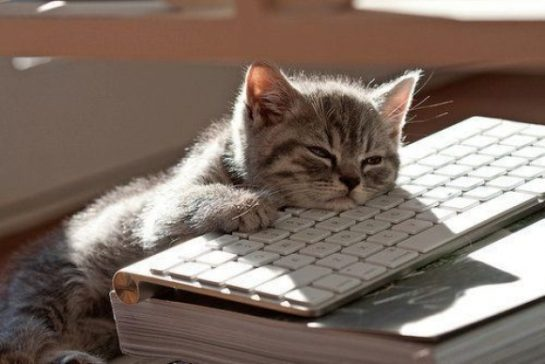
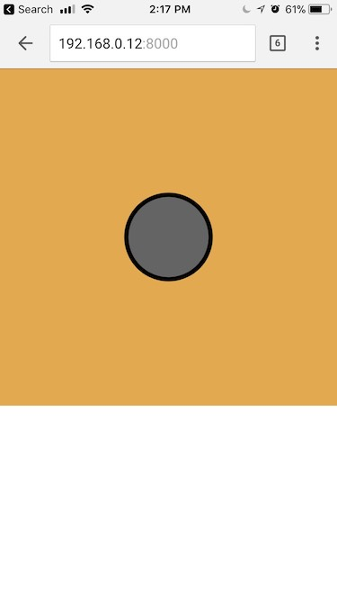

# Coordinate system
> The coordinate system for pixels in a computer window, however, is reversed along the y-axis. (0,0) can be found at the top left with the positive direction to the right horizontally and down vertically.

[https://processing.org/tutorials/drawing/]([https://processing.org/tutorials/drawing/])

<br/>


<br/>

# Mouse Position
The p5 variables mouseX and mouseY (note the capital X and Y) store the x-coordinate and y-coordinate of the cursor relative to the origin in the upper-left corner of the display window. To see the actual values produced while moving the mouse, run this program to print the values to the console:

```
function draw() {
  println(mouseX + " : " + mouseY);
}
```

- mouseX
- mouseY

*The system variable mouseX always contains the current horizontal position of the mouse, relative to (0, 0) of the canvas. If touch is used instead of mouse input, mouseX will hold the x value of the most recent touch point.*

```
// the following will draw a rectangle at your mouse position
function draw() {
  background(244, 248, 252);
  rect(mouseX, mouseY, 100, 100);
}
```


When a program starts, the mouseX and mouseY values are 0. If the cursor moves into the display window, the values are set to the current position of the cursor. If the cursor is at the left, the mouseX value is 0 and the value increases as the cursor moves to the right. If the cursor is at the top, the mouseY value is 0 and the value increases as the cursor moves down. If mouseX and mouseY are used in programs without a draw() or if noLoop() is run in setup(), the values will always be 0.

The mouse position is most commonly used to control the location of visual elements on screen. More interesting relations are created when the visual elements relate differently to the mouse values, rather than simply mimicking the current position. Adding and subtracting values from the mouse position creates relationships that remain constant, while multiplying and dividing these values creates changing visual relationships between the mouse position and the elements on the screen. In the first of the following examples, the circle is directly mapped to the cursor, in the second, numbers are added and subtracted from the cursor position to create offsets, and in the third, multiplication and division are used to scale the offsets.

# Mouse Events

Computer mice and other related input devices typically have between one and three buttons; Processing can detect when these buttons are pressed with the mousePressed and mouseButton variables. Used with the button status, the cursor position enables the mouse to perform different actions. For example, a button press when the mouse is over an icon can select it, so the icon can be moved to a different location on screen. The mousePressed variable is true if any mouse button is pressed and false if no mouse button is pressed. The variable mouseButton is `LEFT`, `CENTER`, or `RIGHT` depending on the mouse button most recently pressed. The `mousePressed` variable reverts to false as soon as the button is released, but the `mouseButton` variable retains its value until a different button is pressed. These variables can be used independently or in combination to control the software. Run these programs to see how the software responds to your fingers.

<i>The mouse event functions are `mousePressed()`, `mouseReleased()`, `mouseMoved()`, and `mouseDragged()`:</i>

##### mouseReleased()
Code inside this block is run one time when a mouse button is pressed mouseReleased()

##### mouseMoved()
Code inside this block is run one time when a mouse button is released mouseMoved()

##### mouseDragged()
Code inside this block is run one time when the mouse is moved mouseDragged()

##### mousePressed()
Code inside this block is run one time when the mouse is moved while a mouse button is pressed


# A drawing app
Combine what we learned above to create a drawing app. Use your mouse do draw.


```
function mouseDragged() {
  // drag to draw a line from previous mouse position
  // to current mouse position
  stroke(random(255),random(255),random(255));
  line(mouseX, mouseY, pmouseX, pmouseY);
}
```

- mouseX
- mouseY
- pmouseX
- pmouseY


# Creating interfaces

Since we can now keep track of our mouse position and click events, we can begin to build apps that begin to explore hovering, clicking, dragging and even tapping / pinching elements on the screen.

The first step is to calculate if our `mouseX`, `mouseY` positions are within the bounding box of our object. Let's start with simple rectangle and ellipse shapes.


https://processing.org/examples/button.html

<br/>

##### Rectangular buttons
The most common type of bounding box is a rectangle. Our mouse is inside a rectangle when `mouseX` and `mouseY` are inside it's bounds.

The bounds of a rectangle can be thought of like its area.

- x position of the rectangle plus the rectangles width
- y position of the rectangle plus the rectangles height

```
// check if mouse is inside the rectangle
// mouseX >= x && mouseX <= x+width && mouseY >= y && mouseY <= y+height
if (mouseX >= 150 && mouseX <= 150+100 && mouseY >= 150 && mouseY <= 150+100){
  isOverRectangle = true;
} else {
  isOverRectangle = false;
}
```

<br/>

##### Circular buttons
We can calculate the distance from our mouse position to the center of a point. If this value is less than the radius of your object - our mouse cursor must be inside. See the example below.


```
// get distance between mouse and circle
var distance = dist(mouseX, mouseY, 200, 200);

// if the distance is less than the circle's radius
if(distance < 50) {
  isOverCircle = true;
} else {
  isOverCircle = false;
}
```

[http://coursescript.com/notes/interactivecomputing/interactivity/](http://coursescript.com/notes/interactivecomputing/interactivity/)
> Tutorial via John Kuiphoff / Interactive Computing

# Keyboard Events
Processing registers the most recently pressed key and whether a key is currently pressed. The boolean variable keyPressed is true if a key is pressed and is false if not. Include this variable in the test of an if structure to allow lines of code to run only if a key is pressed. The keyPressed variable remains true while the key is held down and becomes false only when the key is released.




##### keyPressed()
```
function keyPressed() {
    if(keyCode == UP_ARROW) {
        colorValue = 0;
    } else if (keyCode == DOWN_ARROW) {
        colorValue = 255;
    }
    return 0;
}
```

##### keyReleased()
```
function keyPressed() {
    if(keyCode == UP_ARROW) {
        colorValue = 0;
    } else if (keyCode == DOWN_ARROW) {
        colorValue = 255;
    }
    return 0;
}
```

##### keyCode
In addition to reading key values for numbers, letters, and symbols. If you're making cross-platform projects, note that the Enter key is commonly used on PCs and UNIX and the Return key is used on Macintosh. Check for both Enter and Return to make sure your program will work for all platforms.

*The variable keyCode is used to detect special keys such as BACKSPACE, DELETE, ENTER, RETURN, TAB, ESCAPE, SHIFT, CONTROL, OPTION, ALT, UP_ARROW, DOWN_ARROW, LEFT_ARROW, RIGHT_ARROW You can also check for custom keys by looking up the keyCode of any key on a site like this: [http://keycode.info/](http://keycode.info/)*

```
if (keyCode == UP_ARROW) {
    y += 1;
}
```

##### key
The key variable stores a single alphanumeric character. Specifically, it holds the most recently pressed key. The key can be displayed on screen with the text() function (p. 150).

`text(key, 33,65); // Display last key pressed.`

The key variable may be used to determine whether a specific key is pressed. The following example uses the expression key=='A' to test if the A key is pressed. The single quotes signify A as the data type char (p. 144). The expression key == "A" will cause an error because the double quotes signify the A as a String, and it's not possible to compare a String with a char. The logical AND symbol, the && operator, is used to connect the expression with the keyPressed variable to ascertain that the key pressed is the uppercase A.

##### keyIsPressed
```
function draw() {
  background(0);
  // If the 'A' key is pressed fill white
  if ((keyIsPressed == true) && (key == 'A')) {
    fill(255);
  } else {
  	 // otherwise, fill black
    fill(0);
  }
}
```

The previous example works with an uppercase A, but not if the lowercase letter is pressed. To check for both uppercase and lowercase letters, extend the relational expression with a logical OR, the || relational operator. Line 4 in the previous program would be changed to:

```
if ((keyIsPressed == true) && ((key == 'a') || (key == 'A'))) {
	// your code here
}
```

Because each character has a numeric value as defined by the ASCII table (p. 605), the value of the key variable can be used like any other number to control visual attributes such as the position and color of shape elements. For instance, the ASCII table defines the uppercase A as the number 65, and the digit 1 is defined as 49.

##### Simple Drawing app

```
function setup() {
 	createCanvas(displayWidth, displayHeight);
	strokeWeight(10)
	stroke(0);
}

function mouseMoved() {
	// draw a line from previouse mouse position
	// to current mouse position
	line(mouseX, mouseY, pmouseX, pmouseY);
	return false;
}
```


# Touch Events


##### touchStarted()
[https://p5js.org/reference/#/p5/touchStarted](https://p5js.org/reference/#/p5/touchStarted)

```
function touchStarted() {
  if (value == 0) {
    value = 255;
  } else {
    value = 0;
  }
}
```

NOTE: Browsers may have different default behaviors attached to various touch events. To prevent any default behavior for this event, add "return false" to the end of the method.

```
function touchStarted() {
  ellipse(mouseX, mouseY, 5, 5);
  // prevent default
  return false;
}
```

##### touchMoved()
##### touchEnded()
##### touches[]
You can loop through touches and access each individual one like:
```
xpos = touches[0].y
ypos = touches[0].x
```

##### touchX - x position of a touch
##### touchY - y position of a touch

The system variable touches[] contains an array of the positions of all current touch points, relative to (0, 0) of the canvas, and IDs identifying a unique touch as it moves. Each element in the array is an object with x, y, and id properties.

NOTE: The touches[] array is not supported on Safari and IE on touch-based desktops (laptops).

# Mobile
p5 also supports mobile devices. You may be wondering how do we get our applications running on our phones. Earlier we talked about code 'living' in sperate places like a server versus locally on our machines.



As long as our phones and computer running on the same wifi - your app should work on your phone but connecting your browser to your computers IP and PORT.

# HTML ELEMENTS
Creating elements in p5:

- Beyond the canvas
	- HTML buttons
	- HTML sliders
	- [https://github.com/processing/p5.js/wiki/Beyond-the-canvas](https://github.com/processing/p5.js/wiki/Beyond-the-canvas)
