# Introduction to Computer Vision and Video Processing

<br/>

#### Introduction

The following document is an overview on creating interactive experinces using computer vision, video and cameras as our tools. We stand on the shoulders of giants!

<br/>

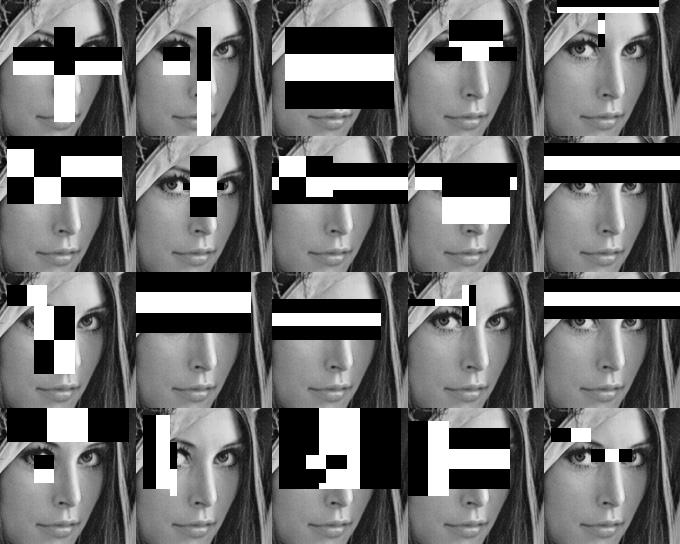

<br/>

> Adapted from Golan Levins <i>Computer Vision for Artists and Designers: Pedagogic Tools and Techniques for Novice Programmers</i>

>
"Computer vision" refers to a broad class of algorithms that allow computers to make intelligent assertions about digital images and video. Historically, the creation of computer vision systems has been regarded as the exclusive domain of expert researchers and engineers in the fields of signal processing and artificial intelligence. Likewise, the scope of application development for computer vision technologies, perhaps constrained by conventional structures for research funding, has generally been limited to military and law-enforcement purposes. Recently, however, improvements in software development tools for student programmers and interactive-media artists — in combination with the rapid growth of open-source code-sharing communities, predictable increases in PC processor speeds, and plummeting costs of digital video hardware — have made widespread artistic experimentation with computer vision techniques a reality. The result is a proliferation of new practitioners with an abundance of new application ideas, and the incorporation of computer vision techniques into the design vocabularies of novel artworks, games, home automation systems, and other areas. This article attempts to demystify computer vision for novice programmers, through a survey of new applications in the arts, system design considerations, and contemporary tools.

<br/>

# Topics
Computer Vision is a ginormouse and fast changing field. Below is a list of topics we will touch on this lesson as they pertain to p5.js.

- ##### Understanding Two Dimensional Arrays & Nested Loops
	- Image processing
	- Computer Vision Algorithms and Implementation
	- Drawing Grids
	- Looping through an image

- ##### Video
	- loading and playing

- ##### Color
	- Image Filters
	- Color Spectrums
	- Histograms
	- Brightest Pixel
	- Tracking Colors

- ##### CV Techniques
	- Thresholding
	- Contours
		- Blobs, Centroids
	- OpenTSPS
	- Edge Detection
	- Motion
	- Background Subtraction

- ##### Detection and Tracking
	- Faces
		- Face Detection
		- Face Tracking
		- CV Dazzle
	- Objects
	- Haar Classifiers
	- Skeletal Tracking

- ##### Hardware and Setups
	- Webcams
	- [Microsoft Kinect](http://shiffman.net/p5/kinect/)
		- What are point clouds?
		- Depth Masks
	- Depthkit
	- [Leap Motion](https://www.leapmotion.com/)
		- [hswick: Example 1](https://github.com/hswick/LeapP5Example/blob/master/index.html)
		- [Neurogami: Example 2](https://github.com/Neurogami/LeapMotionP5)
	- Google StreetView / Lidar
	- 360 Cameras
	- Thermal
	- VR
	- Projectors

- ##### Application
	- Face Tracking
	- Gestures
	- Machine Learning
	- Surveillance
	- VR
	- AR 
	- 3D Scanning

<br/>

# People, Projects and Talks
So many wonderful projects and people; this is just a tiny tiny list that has inspired us throughout the years. Let me know if I'm missing one of your favorites!

- [Danny Rozin: Wooden Mirror](https://www.youtube.com/watch?v=1ZPJ0U_kpNg)
- Golan Levin
	- [Hands](http://www.flong.com/projects/augmented-hand-series/)
	- Orbital View
	- [Art that looks back at you](https://www.ted.com/talks/golan_levin_ted2009)
- Zach Lieberman
	- [Eye Writer](http://www.eyewriter.org/)
	- Faces
	- [Daily Sketches](https://medium.com/@zachlieberman/daily-sketches-2016-28586d8f008e)
	- AR Experiments
- [Kyle McDonald](http://kylemcdonald.net/)
	- ofxCV
	- p5 + CV
	- [Nueral Talk and Walk](https://vimeo.com/146492001)
	- [Face OSC](https://vimeo.com/29348533)
- [Theo Watsen and Emily Gabrielle: Design I/O](http://design-io.com/)
	- [Auto Smiley Generator](https://vimeo.com/10356980)
- [Elliot Woods](http://www.kimchiandchips.com/)
- [Memo Akten](https://www.memo.tv/)
- [Google: Quick Draw](https://quickdraw.withgoogle.com/)
- [Matt Parker](http://gamecenter.nyu.edu/faculty/matt-parker/)
	- [Lumarca](http://lumarca.info/)
- [Andrea Wolf: Video Paint](http://www.andreawolf.me/artwork/video-paint-series)
- [Rain Room](https://laughingsquid.com/the-making-of-the-rain-room-interactive-water-installlation/)
- [Daniel Shiffman: Computer Vision](https://www.youtube.com/watch?v=h8tk0hmWB44&list=PLRqwX-V7Uu6aG2RJHErXKSWFDXU4qo_ro)
- [Støj: Object Masking](https://vimeo.com/199488031)
- [Area of Effect: BeatBot](http://www.areaofeffect.io/projects/beatbot)

<br/>

# 2 Dimensional Array
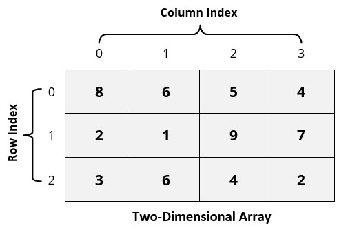

> An array keeps track of multiple pieces of information in linear order, a one-dimensional list. However, the data associated with certain systems (a digital image, a board game, etc.) lives in two dimensions. To visualize this data, we need a multi-dimensional data structure, that is, a multi-dimensional array. A two-dimensional array is really nothing more than an array of arrays (a three-dimensional array is an array of arrays of arrays).

- [via Processing](https://processing.org/tutorials/2darray/)

<br/>

##### p5 2D Array + Grid Example
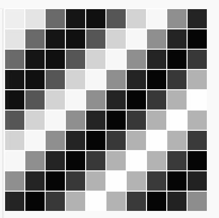

```
// Number of columns and rows in the grid
var cols = 10;
var rows = 10;


var grid = new Array(cols);


function setup() {
  createCanvas(200,200);
	
	//grid = new Cell[cols][rows];
  for (var i = 0; i < cols; i++) {
		grid[i] = [];
		
    for (var j = 0; j < rows; j++) {
      // Initialize each object
      grid[i][j] = new Cell(i*20,j*20,20,20,i+j);
    }
  }
	
}

function draw() {
  background(0);
  // The counter variables i and j are also the column and row numbers and 
  // are used as arguments to the constructor for each object in the grid.  
  for (var i = 0; i < cols; i++) {
    for (var j = 0; j < rows; j++) {
      // Oscillate and display each object
      grid[i][j].oscillate();
      grid[i][j].display();
    }
  }
}

// A Cell object
function Cell (tempX,  tempY,  tempW,  tempH, tempAngle){
  // A cell object knows about its location in the grid 
  // as well as its size with the variables x,y,w,h
  this.x = tempX;
  this.y = tempY;
  this.w = tempW;
  this.h = tempH;
  this.angle = tempAngle;
  
  // Oscillation means increase angle
  this.oscillate = function () {
    this.angle += 0.02; 
  }

  this.display = function () {
    stroke(255);
    // Color calculated using sine wave
    fill(127+127*sin(this.angle));
    rect(this.x,this.y,this.w,this.h); 
  }
};
```

<br/>

# Nested Loops
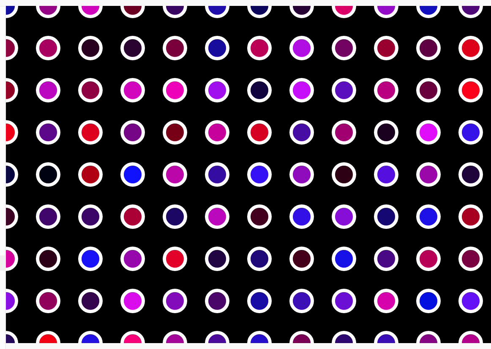
> via [Coding Train](https://www.youtube.com/watch?v=OTNpiLUSiB4)

Consider the following sketch:

```
function setup() {
  createCanvas(600, 400);  
}

function draw() {
  background(0);
  strokeWeight(4);
  stroke(255);

  for (var x = 0; x <= mouseX; x += 50) {
    for (var y = 0; y <= height; y += 50) {
    fill(random(255), 0, random(255));
    ellipse(x, y, 25, 25);
    }
  }
}
```

<br/>

# Looping through an image
Images are made up of arrays of pixel data. Think of them as being up 
of two arrays. The first array representing the columns and the second representing rows. Together they form a two dimensional array.

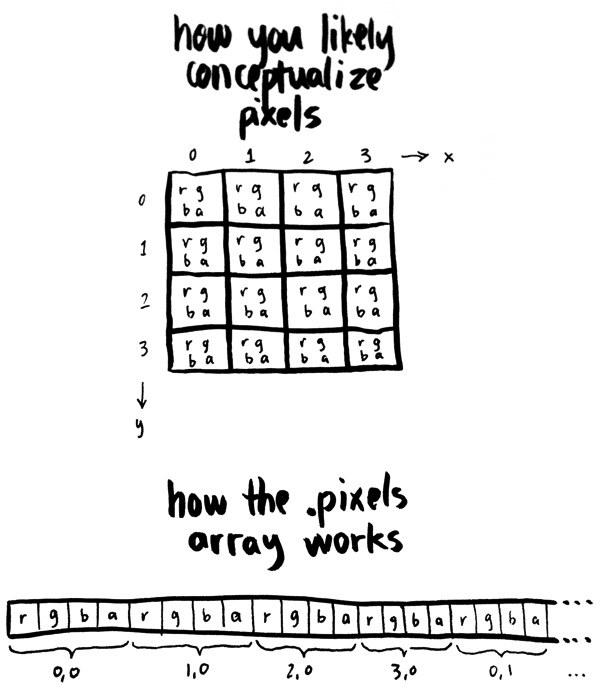
> via [Allison Parrish: Creative Coding](http://creative-coding.decontextualize.com/video/)

In the example above, the two for loops iterate from zero to the width and height in both dimensions. The expression ((y*width)+x)*4 gives the offset of the four values that correspond to the color of the pixel at x and y. Then, I set the fill color to the red value for that pixel by getting the value at vid.pixels[offset], the green value for that pixel by evaluating vid.pixels[offset+1], and the blue value by evaluating vid.pixels[offset+2]. (Also note that I changed the size of the sketch to the size of the underlying video in order to make all this math easier.)

<br/>

# Face Detection
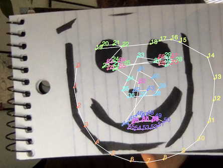

Face detection can be regarded as a specific case of object-class detection. In object-class detection, the task is to find the locations and sizes of all objects in an image that belong to a given class. Examples include upper torsos, pedestrians, and cars.

Face-detection algorithms focus on the detection of frontal human faces. It is analogous to image detection in which the image of a person is matched bit by bit. Image matches with the image stores in database. Any facial feature changes in the database will invalidate the matching process.

##### How it works
Firstly, the possible human eye regions are detected by testing all the valley regions in the gray-level image. Then the genetic algorithm is used to generate all the possible face regions which include the eyebrows, the iris, the nostril and the mouth corners.

Each possible face candidate is normalized to reduce both the lightning effect , which is caused by uneven illumination; and the shirring effect, which is due to head movement. The fitness value of each candidate is measured based on its projection on the eigen-faces. After a number of iterations, all the face candidates with a high fitness value are selected for further verification. At this stage, the face symmetry is measured and the existence of the different facial features is verified for each face candidate.

#### The Scramble Suit
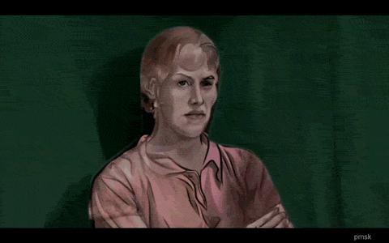

- [Active shape model](https://en.wikipedia.org/wiki/Active_shape_model)
> Active Shape Models (ASM) are an advanced detection technique that tries to fit a shape to an object. It uses external information (like Haar detection) to make an initial guess, and then iteratively refines the guess. 

- [Scramble](https://www.auduno.com/clmtrackr/examples/facesubstitution.html)

<br/>

##### Counter-surveillance

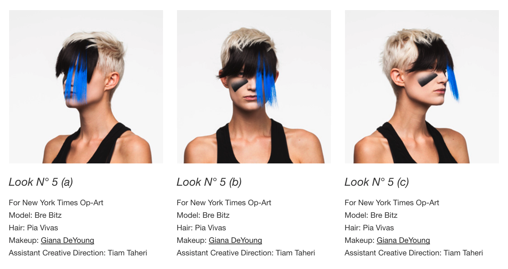

> CV Dazzle explores how fashion can be used as camouflage from face-detection technology, the first step in automated face recognition.

- [Face Substitution](https://vimeo.com/29279198)
- [ITP: Face It!](https://github.com/shiffman/Face-It)
- [Person recognition in social media photos](https://arxiv.org/pdf/1710.03224.pdf)
- [Adam Harvey: CV DAZZLE](https://cvdazzle.com/)
- [Is it possible to opt-out of face recognition databases?](https://arxiv.org/pdf/1705.07426.pdf)
- [Face classification and emotion detection](https://github.com/ekholabs/face_classification)
- [Pareidolia](http://urbanhonking.com/ideasfordozens/2012/01/14/machine-pareidolia-hello-little-fella-meets-facetracker/)

<br/>

### Glossary
##### Thresholding


Thresholding is the simplest method of image segmentation. From a grayscale image, thresholding can be used to create binary images.

<br/>

##### Edge Detection
Edge detection includes a variety of mathematical methods that aim at identifying points in a digital image at which the image brightness changes sharply or, more formally, has discontinuities. The points at which image brightness changes sharply are typically organized into a set of curved line segments termed edges. 

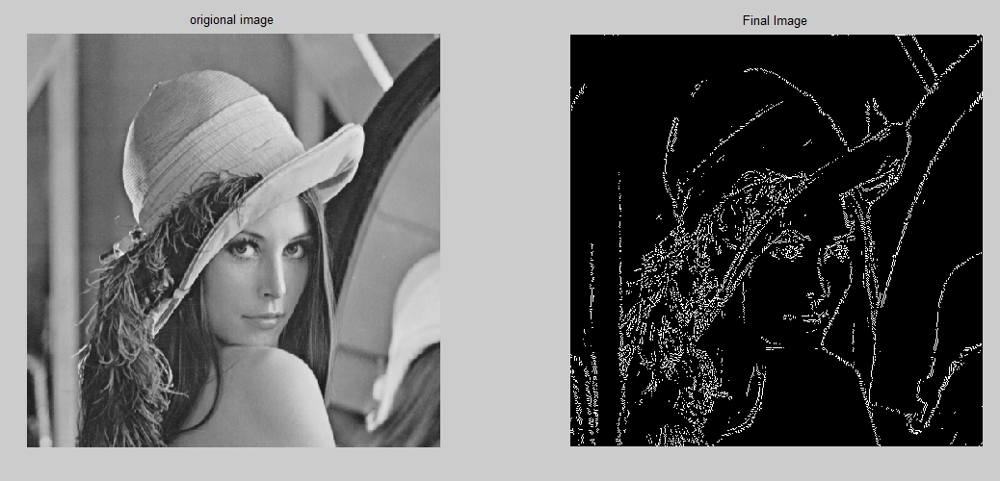

> Lenna or Lena is the name given to a standard test image widely used in the field of image processing since 1973. [Lena Söderberg](https://en.wikipedia.org/wiki/Lenna)

<br/>

##### Contours
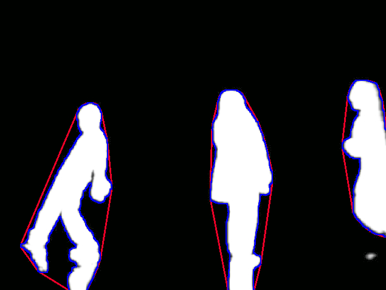

Contours can be explained simply as a curve joining all the continuous points (along the boundary), having same color or intensity. The contours are a useful tool for shape analysis and object detection and recognition.

- For better accuracy, use binary images. So before finding contours, apply threshold or canny edge detection.
- findContours function modifies the source image. So if you want source image even after finding contours, already store it to some other variables.
- In OpenCV, finding contours is like finding white object from black background. So remember, object to be found should be white and background should be black.

<br/>

##### Fiducials
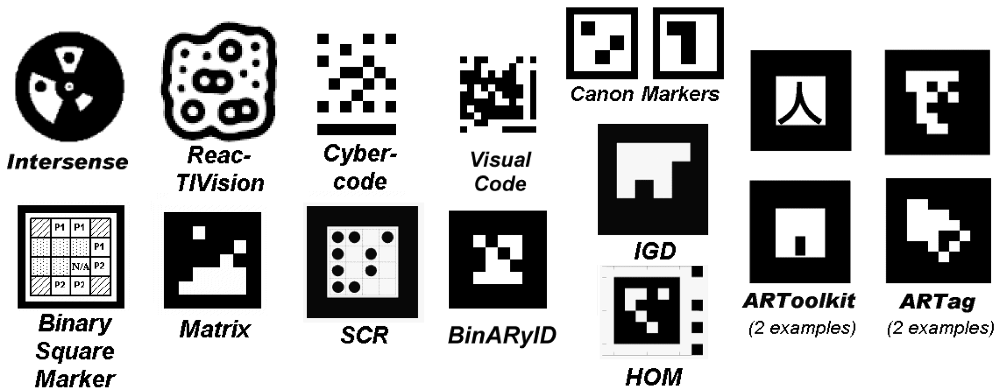

A fiducial marker or fiducial is an object placed in the field of view of an imaging system which appears in the image produced, for use as a point of reference or a measure. It may be either something placed into or on the imaging subject, or a mark or set of marks in the reticle of an optical instrument.

<br/>

# CV + Machine learning
- [DeepFace + dlib 99% Acuracy](https://github.com/kylemcdonald/ml-examples/blob/master/workshop/faces/Face%20Detection%2C%20Tracking%2C%20and%20Recognition.ipynb)
- [Kyle McDonald: A Return to Machine Learning](https://medium.com/@kcimc/a-return-to-machine-learning-2de3728558eb)
- [Google Deep dream](https://photos.google.com/share/AF1QipPX0SCl7OzWilt9LnuQliattX4OUCj_8EP65_cTVnBmS1jnYgsGQAieQUc1VQWdgQ?key=aVBxWjhwSzg2RjJWLWRuVFBBZEN1d205bUdEMnhB)
- [Nueral Style Transfer](https://github.com/jcjohnson/neural-style)
- [GIORGIO CAM](https://experiments.withgoogle.com/ai/giorgio-cam/view/)

<br/>

# AR / ARKIT

- https://github.com/laanlabs/ARBrush
- https://github.com/olucurious/Awesome-ARKit

<br/>

# Projection Mapping

- [Maptastic](https://github.com/glowbox/maptasticjs)
- [Mappathon](http://mappathon.com/)
- [Get it out of your system with this one :)](https://www.youtube.com/watch?v=lX6JcybgDFo)
- So much more here if there is interest.

<br/>

# Thermal
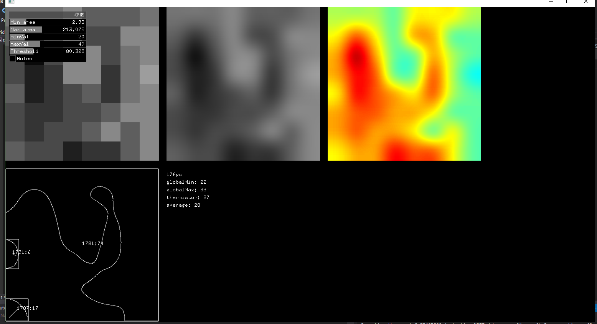

> A thermal imaging camera (colloquially known as a TIC) is a type of thermographic camera used in firefighting. By rendering infrared radiation as visible light, such cameras allow firefighters to see areas of heat through smoke, darkness, or heat-permeable barriers. Thermal imaging cameras are typically handheld, but may be helmet-mounted. They are constructed using heat- and water-resistant housings, and ruggedized to withstand the hazards of fireground operations.

- [Panasonic GridEye Sensor](https://eewiki.net/display/projects/Panasonic+GridEYE+Breakout+Board+and+GUI)

<br/>

# Optical Touch

- Optical Multi-touch
- Projecting on surfaces 

<br/>

# 3D Scanning

- Kinect
- Point Clouds
- [James George: DepthKit](depthkit crunchbase)
- More of an advanced topic. More here if there is interst.

<br/>

# Tips for setting up your CV project

- Lighting! The most important thing.
- What kind of camera are you using and how will you mount it?
- Whats behind the camera? This will guide you into what CV techniques you need to apply.
- Experiment! Different CV techniques perform differently in various situations and locations.
- Use mapping functions! Remember once you track an object, color or face you can map the position values to drawing in your sketch.


<br/>

# Assignment

#### 1. readings
- [Golan Levin: Computer Vision for artists and designers](http://www.flong.com/archive/texts/essays/essay_cvad/index.html)
- [Kyle McDonald: Appropriating New Technologies](https://github.com/kylemcdonald/AppropriatingNewTechnologies/wiki/Week-2)
- [Zach Leiberman: Daily Sketches](https://medium.com/@zachlieberman/daily-sketches-2016-28586d8f008e)
- [Allison Parish: Working with Video](http://creative-coding.decontextualize.com/video/)
- [Awesome computer vision](https://github.com/jbhuang0604/awesome-computer-vision)

#### 2. Code
Choose a Technique / Method or Tool from above and create a sketch. Remember to check out the 'Tips for setting up your CV project' for best results.

- Upload your sketch to GitHub
- Remember to submit documentation describing your project setup, approach and challenges as a README.md.

<br/>

#### p5js CDN
- https://cdnjs.cloudflare.com/ajax/libs/p5.js/0.5.16/p5.min.js

<br/>

# CHROME ACCESS TIPS
- open -a Google\ Chrome --args --allow-file-access-from-files
